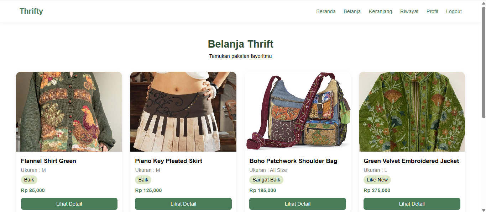
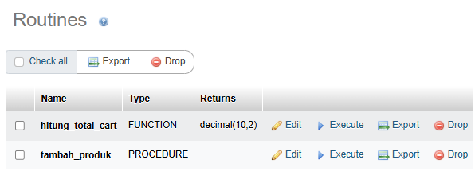
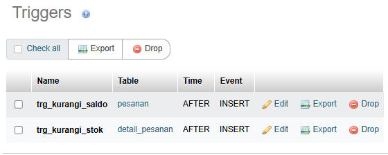

# 🛍️ Thrifty (Proyek UAP)

Proyek ini merupakan sistem e-commerce thrift yang dibangun menggunakan PHP dan MySQL. Tujuannya sebagai platform jual beli pakaian thrift yang memungkinkan pengguna melakukan pembelian produk menggunakan saldo akun. Sistem memanfaatkan transaction, procedure, function, trigger, serta backup database untuk menjaga konsistensi dan keamanan data selama proses transaksi berlangsung.



## 📌 Detail Konsep

👣 Stored Procedure bertindak sebagai mekanisme yang membantu mengelola operasi tertentu langsung di database. Dengan menyimpan logika pada database, proses menjadi lebih terstruktur dan dapat digunakan kembali oleh aplikasi tanpa perlu menulis query yang sama berulang kali.




Beberapa procedure, function, dan trigger yang digunakan:

### AdminController.php

`tambah_produk(p_nama, p_harga, p_stok, p_ukuran, p_kondisi, p_gambar, p_deskripsi)`

Stored Procedure `tambah_produk()` digunakan untuk menambahkan data produk baru ke dalam sistem.

```php
mysqli_query(
    $this->conn,
    "CALL tambah_produk(
        '$nama',
        '$harga',
        '$stok',
        '$ukuran',
        '$kondisi',
        '$gambar',
        '$deskripsi'
    )"
);
```

Procedure ini menerima data produk dari form admin dan menyimpannya ke tabel `produk`, sehingga produk dapat langsung ditampilkan pada halaman katalog maupun beranda aplikasi.

### Cart.php

`hitung_total_cart(p_user)`

Function ini digunakan untuk menghitung total harga produk yang terdapat pada keranjang pengguna.

```
    $query = mysqli_query(
        $conn,
        "SELECT hitung_total_cart($id_user) AS total"
    );
```

### Order / Detail Pesanan

`trg_kurangi_stok`

Trigger ini digunakan untuk menjaga konsistensi stok produk setelah terjadi transaksi pembelian.

Ketika data baru ditambahkan ke tabel detail_pesanan, trigger akan secara otomatis mengurangi stok produk sesuai jumlah yang dibeli.

```sql
BEGIN
    UPDATE produk
    SET stok = stok - NEW.qty
    WHERE id_produk = NEW.id_produk;
END
```

Dengan trigger ini, stok produk akan selalu diperbarui secara otomatis tanpa perlu proses update tambahan dari aplikasi.

### Pesanan

**trg_kurangi_saldo**

Trigger `trg_kurangi_saldo` digunakan untuk mengurangi saldo pengguna secara otomatis setelah data pesanan berhasil dibuat.

Definisi trigger:

```sql
BEGIN

    UPDATE users

    SET saldo = saldo - NEW.total

    WHERE id_user = NEW.id_user;

END
```

Dengan trigger ini, proses pemotongan saldo tidak perlu dilakukan secara manual oleh aplikasi sehingga konsistensi data pengguna dan transaksi tetap terjaga.


## 💾 Backup Otomatis

Untuk menjaga keamanan dan ketersediaan data, sistem Thrifty dilengkapi fitur backup database otomatis menggunakan utilitas mysqldump. Backup ini bertujuan untuk mengantisipasi kehilangan data akibat kesalahan sistem, kerusakan database, atau faktor lainnya.

Backup dilakukan melalui file `backup.php` dan hanya dapat dijalankan oleh administrator yang telah melakukan login. Sebelum proses backup dijalankan, sistem akan memverifikasi session pengguna dan role admin untuk memastikan keamanan akses.

📄 backup.php

```
<?php
session_start();

if (!isset($_SESSION['user_id']) || $_SESSION['role'] !== 'admin') {
    header('Location:index.php?page=login');
    exit;
}

date_default_timezone_set('Asia/Jakarta');

$backup_dir = __DIR__ . '/storage/backups/';

if (!is_dir($backup_dir)) {
    mkdir($backup_dir, 0755, true);
}

$date = date('Y-m-d_H-i-s');
$backupFile = $backup_dir . "thrifty_backup_$date.sql";

$mysqldump_path = "C:\\laragon\\bin\\mysql\\mysql-8.0.30-winx64\\bin\\mysqldump.exe";

$db_user = 'root';
$db_pass = '';
$db_name = 'thrifty';

$command = "\"$mysqldump_path\" -u $db_user ";

if (!empty($db_pass)) {
    $command .= "-p$db_pass ";
}

$command .= "$db_name --result-file=\"$backupFile\"";

exec($command, $output, $return_var);

header("Location:index.php?page=admin-dashboard&backup=success");
exit;
?>
```
